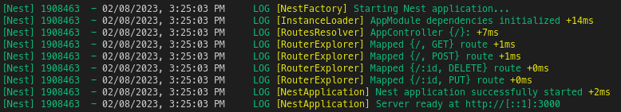
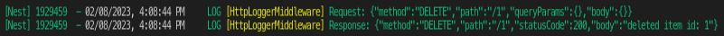

# OVERVIEW
This project implements in a NestJS application an interceptor, more commonly known as _middleware_, to log the details about each HTTP request, such as HTTP method, query-parameters, body as well as the details about the produced response instance.

# PREREQUISITES
- Git
- Node.js (version >= 14)
- cUrl or Postman

# CLONE & CONFIGURE THE APPLICATION
Open a terminal console and execute the following:
1. Clone the application locally
```bash
git clone https://github.com/davidarchanjo/nestjs-logging-request-response.git
```
2. Install the application's dependencies
```bash
cd nestjs-logging-request-response
npm install
```

# EXECUTE THE APPLICATION
From the terminal console where the previous commands were executed,  run:
```bash
npm run start
```
This command starts the application with the HTTP server listening on the port defined in the [main.ts](./src/main.ts) file. From the terminal console, you should get an output like:


# TESTING
Once the application is running, open another terminal console to issue some request to the application and generate some logging by using the [cURL](https://curl.se/) command line tool.
> 📌 You can use Postman for this purpose if you like
## GET
| Command | Output |
| :------ | :----- |
| `curl --request GET 'http://localhost:3000?foo=bar&bar=foo'` |  |
### QUERY-PARAMETERS
| Command | Output |
| :------ | :----- |
| `curl --request GET 'http://localhost:3000?foo=bar&bar=foo'` |  |

## POST
| Command | Output |
| :------ | :----- |
| `curl --request POST 'http://localhost:3000' --header 'Content-Type: application/json' --data-raw '{"bar": 1, "foo": "bar"}'` |  |


## PUT
| Command | Output |
| :------ | :----- |
| `curl --request PUT 'http://localhost:3000/1' --header 'Content-Type: application/json' --data-raw '{"bar": "foo"}'` |  |


## DELETE
| Command | Output |
| :------ | :----- |
| `curl --request DELETE 'http://localhost:3000/1'` |  |
